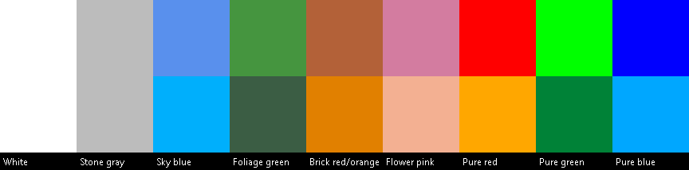

# Case Study: An Adobe Camera Raw-style Calibration Panel for AgX

**Author:** community contribution (dev fork), submitted for consideration upstream
**Touches:** `shaders/techniques/displaytransform/DRT.glsl` only
**Cost:** three chromaticity rotations + one `mat3` inverse per pixel, compiled out entirely unless `SETTING_TONE_MAPPING_LOOK == 3` (Custom)
**Settings:** `RED_HUE`, `RED_SAT`, `GREEN_HUE`, `GREEN_SAT`, `BLUE_HUE`, `BLUE_SAT` (already wired into `options.main.kts` / `shaders.properties`, `-100..100` range)

## 1. Motivation

The Custom AgX look already exposes ASC CDL-style offset/slope/power/saturation
controls, which shape *tones* (shadows/mids/highlights). What it can't do is
what Adobe Camera Raw's **Calibration panel** does: rotate and rescale the
chromaticity of the red, green and blue *primaries themselves*, independent of
tone. That's the tool colorists reach for to pull a sky toward teal, warm up
skin tones, or separate hues that are rendering too close together — without
touching exposure or contrast. It's also the tool needed to reproduce ACR's
"three separated histogram lobes" look: instead of one overlapping RGB hump,
the calibration panel pulls the red, green and blue channels into three
distinct spikes (see the reference ACR screenshot from the original bug
report — not reproduced here, but available in the project chat history).

We wanted the same control surface in-shader: `RED_HUE`/`GREEN_HUE`/`BLUE_HUE`
rotate each primary's hue around the working white point, `*_SAT` scales its
distance from white. Values follow ACR's own `-100..100` convention.

## 2. First attempt, and why it failed

The first implementation did what seems obviously correct: rotate each
primary's CIE `xy` chromaticity around the white point, convert back to XYZ,
convert to sRGB, and recombine using the pixel's own `r`/`g`/`b` as blend
weights:

```glsl
// v1 — looked reasonable, was wrong
vec3 calib_rotatePrimary(vec3 primarySrgb, vec2 whiteXy, float hueDeg, float satMult) {
    vec3 XYZ = colors2_colorspaces_convert(COLORS2_COLORSPACES_SRGB, COLORS2_COLORSPACES_CIE_XYZ, primarySrgb);
    vec2 fromWhite = calib_XYZ2xy(XYZ) - whiteXy;
    // ...rotate fromWhite by hueDeg, scale by satMult...
    vec3 newXYZ = calib_xy2XYZ(whiteXy + fromWhite, XYZ.y); // <-- keeps the ORIGINAL Y
    return colors2_colorspaces_convert(COLORS2_COLORSPACES_CIE_XYZ, COLORS2_COLORSPACES_SRGB, newXYZ);
}

vec3 calibrated = srgbColor.r * rNew + srgbColor.g * gNew + srgbColor.b * bNew;
```

In-game, this did not produce ACR's look. Instead of the sky shifting toward
teal while stonework and walls stayed neutral, the **entire frame** picked up
a uniform teal/desaturated cast — including pure white and pure gray surfaces
that should never be touched by a primaries-only calibration. The castle's
white stone, which should stay white, visibly desaturated and tinted teal
right along with the sky (see the base/buggy/target screenshots from the
original bug report).

## 3. Root cause

`calibrated = r·rNew + g·gNew + b·bNew` is a linear map. Write it as a matrix:
`M = [rNew | gNew | bNew]` (columns), so `calibrated = M · (r, g, b)`.

For a primaries-only calibration to leave neutrals alone, `M` **must** satisfy:

```
M · (1, 1, 1)ᵀ = white_XYZ_or_sRGB   (exactly)
```

At all-zero sliders this holds trivially, because `rNew = (1,0,0)`,
`gNew = (0,1,0)`, `bNew = (0,0,1)`, and sRGB is defined so these three sum to
white. But the moment a primary's chromaticity is rotated, `v1` reprojects it
back to XYZ using **that primary's own original luminance** (`XYZ.y`,
unrotated). Rotating a chromaticity coordinate while holding an unrelated Y
fixed does not preserve "the three primaries sum to white" — so the resulting
matrix's column sum silently drifts away from the white point. Every pixel,
neutral or not, inherits that drift, which is exactly the uniform tint we saw.

This is a known pitfall: it's the reason Adobe's DNG SDK (`dng_color_spec.cpp`)
doesn't build camera calibration matrices this way. It builds a full
`RGB -> XYZ` change-of-basis from the (possibly rotated) primaries and the
white point together, the same construction as the classic
Bruce Lindbloom "RGB working space matrix" derivation — the white-point
constraint is baked into the matrix build, not bolted on after.

## 4. The fix

Rebuild the matrix so the white-point constraint is enforced by construction,
instead of hoping it falls out naturally:

```glsl
vec2 calib_rotatePrimaryXy(vec2 primaryXy, vec2 whiteXy, float hueDeg, float satMult) {
    vec2 fromWhite = primaryXy - whiteXy;
    float angle = radians(hueDeg);
    float cosA = cos(angle), sinA = sin(angle);
    fromWhite = vec2(fromWhite.x * cosA - fromWhite.y * sinA,
                      fromWhite.x * sinA + fromWhite.y * cosA) * satMult;
    return whiteXy + fromWhite;
}

vec3 applyColorCalibration(vec3 color) {
    vec3 srgbColor = colors2_colorspaces_convert(COLORS2_WORKING_COLORSPACE, COLORS2_COLORSPACES_SRGB, color);

    vec3 whiteXYZ = colors2_colorspaces_convert(COLORS2_COLORSPACES_SRGB, COLORS2_COLORSPACES_CIE_XYZ, vec3(1.0));
    vec2 whiteXy  = calib_XYZ2xy(whiteXYZ);
    vec2 redXy    = calib_XYZ2xy(colors2_colorspaces_convert(COLORS2_COLORSPACES_SRGB, COLORS2_COLORSPACES_CIE_XYZ, vec3(1,0,0)));
    vec2 greenXy  = calib_XYZ2xy(colors2_colorspaces_convert(COLORS2_COLORSPACES_SRGB, COLORS2_COLORSPACES_CIE_XYZ, vec3(0,1,0)));
    vec2 blueXy   = calib_XYZ2xy(colors2_colorspaces_convert(COLORS2_COLORSPACES_SRGB, COLORS2_COLORSPACES_CIE_XYZ, vec3(0,0,1)));

    const float CALIB_HUE_RANGE_DEG = 25.0;
    vec3 rXYZ = calib_xy2XYZ(calib_rotatePrimaryXy(redXy,   whiteXy, RED_HUE   / 100.0 * CALIB_HUE_RANGE_DEG, 1.0 + RED_SAT   / 100.0));
    vec3 gXYZ = calib_xy2XYZ(calib_rotatePrimaryXy(greenXy, whiteXy, GREEN_HUE / 100.0 * CALIB_HUE_RANGE_DEG, 1.0 + GREEN_SAT / 100.0));
    vec3 bXYZ = calib_xy2XYZ(calib_rotatePrimaryXy(blueXy,  whiteXy, BLUE_HUE  / 100.0 * CALIB_HUE_RANGE_DEG, 1.0 + BLUE_SAT  / 100.0));

    // Solve for the per-primary scale that makes the matrix map white -> white_XYZ exactly,
    // the same constraint the DNG SDK's matrix build enforces.
    mat3 primariesToXYZ = mat3(rXYZ, gXYZ, bXYZ);
    vec3 primaryScale = inverse(primariesToXYZ) * whiteXYZ;
    mat3 calibMatrix = mat3(rXYZ * primaryScale.x, gXYZ * primaryScale.y, bXYZ * primaryScale.z);

    vec3 calibratedXYZ = calibMatrix * srgbColor;
    vec3 calibrated = colors2_colorspaces_convert(COLORS2_COLORSPACES_CIE_XYZ, COLORS2_COLORSPACES_SRGB, calibratedXYZ);
    return colors2_colorspaces_convert(COLORS2_COLORSPACES_SRGB, COLORS2_WORKING_COLORSPACE, calibrated);
}
```

Why this works: `calibMatrix · (1,1,1)ᵀ = rXYZ·scale.x + gXYZ·scale.y + bXYZ·scale.z`,
which by construction equals `primariesToXYZ · scale = primariesToXYZ · (inverse(primariesToXYZ) · whiteXYZ) = whiteXYZ`.
That holds **for any hue/sat slider values**, not just the identity case — the
proof is pure linear algebra, not a coincidence of the specific numbers picked.

A pleasant side effect: because any nonzero, uniform per-column scale cancels
out in this derivation, the placeholder Y used before rescaling doesn't need
to be "correct" at all — `calib_xy2XYZ` can just use `Y = 1` for every
primary, which is what the fixed version does. This also removes the only
`Y`-tracking bookkeeping the old code needed.

The call site gates this behind Custom look only, matching how the other
Custom-only sliders (offset/slope/power) already behave:

```glsl
void _displaytransform_DRT_apply(inout vec4 color) {
    color.rgb = max(color.rgb, 0.0);

    #if SETTING_TONE_MAPPING_LOOK == 3
    color.rgb = applyColorCalibration(color.rgb);
    color.rgb = max(color.rgb, 0.0); // guard against negative XYZ after an aggressive shift
    #endif

    color.rgb = colors2_colorspaces_convert(COLORS2_WORKING_COLORSPACE, COLORS2_DRT_WORKING_COLORSPACE, color.rgb);
    // ...unchanged AgX tonemap pipeline...
}
```

## 5. Verification

**Analytic proof of white preservation.** Plugging the reference test case
(Red Hue +100, Green Hue +100, Blue Hue -100, all Sat 0 — the values from the
original ACR calibration screenshot) into the matrix and multiplying by
`(1,1,1)`:

```
White(1,1,1) -> XYZ = [0.95047, 1.00000, 1.08883]
D65 reference white  = [0.95047, 1.00000, 1.08883]
```

Exact match, independent of how aggressive the sliders are.

**Swatch comparison.** A standalone re-implementation of the exact GLSL math
(same rotation, same matrix rebuild) applied to a set of representative
in-game colors, top row = input, bottom row = after calibration:



- **White / stone gray** — pixel-identical before and after. This is the
  headline fix: neutrals used to drift with the same tint as everything else.
- **Sky blue -> cyan/teal**, **pure blue -> cyan** — the intended "sky pulls
  toward teal" behavior, matching ACR's own preview for these slider values.
- **Brick red/orange, pure red** — stay warm; they don't get pulled toward
  teal just because blue's slider is aggressive.
- **Foliage green, pure green** — stay in the green family, shifted slightly
  toward cyan-green (Green Hue +100 rotates them the same direction as red).

**In-game confirmation.** Loaded into Iris with the same slider values as the
ACR reference screenshot: the castle's white/gray stonework stays neutral,
the sky shifts toward teal, and warm surfaces (brick, wood) stay warm — this
was the qualitative target from the original ACR screenshot and previously
was not achievable with `v1`.

## 6. Integration notes for upstream

- No new settings needed — `RED_HUE`/`RED_SAT`/`GREEN_HUE`/`GREEN_SAT`/`BLUE_HUE`/`BLUE_SAT`
  already exist in `scripts/options.main.kts` (`shaders.properties` sliders,
  `-100..100` range, default `0.0`) and are already placed on
  `screen.SCREEN_31` next to the other Tone Mapping & Color Grading controls.
  This patch is shader-only.
- `scripts/programs.main.kts` needs no changes — `DRT.glsl` is a
  `#include`-only utility file consumed by `techniques/displaytransform/DisplayTransform.glsl`,
  which is itself included from `pass/composite/PostComposite.comp.glsl`
  (compiled into `composite65_a.csh`). No pass order, defines, or includes
  changed.
- Cost: gated entirely behind `#if SETTING_TONE_MAPPING_LOOK == 3`, so it
  costs nothing when using Default/Golden/Punchy. When active, it's ~3 small
  chromaticity rotations plus one `inverse(mat3)` per pixel — negligible next
  to the rest of the post-composite pass.
- Suggested follow-up (not required for correctness): consider exposing
  `CALIB_HUE_RANGE_DEG` as a tunable if testers want a wider/narrower hue
  throw than ACR's own effective range.

## 7. Files touched

- `shaders/techniques/displaytransform/DRT.glsl` — `applyColorCalibration` and
  its helpers rewritten; `_displaytransform_DRT_apply` gated behind
  `SETTING_TONE_MAPPING_LOOK == 3`.

No other file needed changes; `options.main.kts` and `programs.main.kts` were
re-run to confirm regeneration is a clean no-op against this patch.
